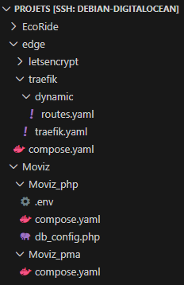

# Moviz : Développement d'un site de critique de film en PHP OBJET et MVC

### Série de lives de AL avec la base MVC provenant du projet Bookeo

* La VUE est dans /templates et /assets.
* Le CONTROLLER est dans /App/Controller.
* Le MODEL est dans les autres dossiers présents dans /App

 

Le projet est déployé sur cette adresse : <a href="https://moviz.emilien-gibeaud.tech/" target="_blank" rel="noopener noreferrer">Moviz</a>

 

## Mise en place locale
A la racine du projet :
* Créer le fichier "db_config.php" à l'aide "db_config.php.exemple"
* Créer le fichier ".env" à l'aide ".env.exemple"

 

Lancer les conteneurs :

    docker compose up -d

Accèder au site via : <a href="http://localhost/" target="_blank" rel="noopener noreferrer">localhost</a> (sans certificat, faire le nécessaire dans le navigateur pour accepter)
 
 

Arrêter les conteneurs :

    docker compose down

 

### Création de la db
* Accèder à PHPMyAdmin : <a href="http://localhost:4216" target="_blank" rel="noopener noreferrer">localhost:4216</a>
* Saisir le user et psw du fichier ".env"
* Créer la base de données et ses tables à l'aide du fichier /App/Db/bdd_create.sql (Onglet "SQL")
* Remplacer "user" par "admin" pour l'utilisateur de la table User à qui on souhaite donner les droits admin (il pourra ajouter un film et valider les critiques)

 

### Création d'une image de prod pour un déploiement futur
Un compte Docker est nécessaire pour pousser l'image qui sera générée sur son Docker Hub

Construire une image :

    docker build -f Dockerfile.prod -t votre_user_docker/moviz:0.1.0 .

Tag d'une image latest (_optionnel_) :

    docker tag emiliengibeaud/moviz:0.1.0 emiliengibeaud/moviz:latest

Envoie sur le Docker Hub :

    docker push votre_user_docker/moviz:0.1.0
    docker push votre_user_docker/moviz:latest

 

## Déploiement sur VPS (avec reverse proxy Traefik)

* Avoir un VPS sécurisé avec Docker installé

Exemple d'organisation des dossiers pour la suite

_(EcoRide est un autre projet déployé sur le VPS d'exemple)_

### Mise en place Traefik

* Créer le conteneur Traefik (dans le dossier souhaité du VPS) à l'aide du dossier "Traefik" (voir instructions en ligne suivante)
* Reproduire le contenu du dossier "Traefik" dans un dossier "edge" et saisir les données nécessaires dans "compose.yaml", "traefik.yaml" et "routes.yaml"
* Il faut avoir créé le nom de dommaine et les sous domaines nécessaires auprès d'un fournisseur (cf. info dans "routes.yaml")

Lancer le conteneur avec :

    sudo docker compose up -d

 

### Mise en place de la stack Moviz

* Créer un dossier Moviz/Moviz_php par exemple sur le VPS
* Y créer et saisir vos données dans les fichiers "compose.yaml", ".env" et "db_config.php" (à l'aide des fichiers "compose.moviz.yaml", ".env.exemple" et "db_config.php.exemple")
* _La stack contient un conteneur "moviz_app" et un conteneur "moviz_db"_

Lancer les conteneurs avec :

    sudo docker compose up -d

L'application sera accessible via votre sous domaine d'application.
 

### Mise en place de PHPMyAdmin (_pour administration ponctuelle_)

* Créer un dossier Moviz/Moviz_pma par exemple sur le VPS
* Y créer le fichier "compose.yaml" (à l'aide de fichier "compose.pma.yaml", ".env.exemple" et "db_config.php.exemple")
* _La stack contient un conteneur "moviz_app" et un conteneur "moviz_db"_

Lancer le conteneur avec :

    sudo docker compose up -d
PHPMyAdmin sera accessible via votre sous domaine PHPMyAdmin (_après avoir saisi votre utilisateur et mot de passe, cf. fichiers ".env" et "db_config.php"_)

> 🚀 --- <strong>NOTE</strong> --- 🚀  
Le conteneur PHPMyAdmin ne devrait être lancé qu'en cas de besoin pour limiter les attaques.  Penser à arrêter le conteneur quand vous n'en avez plus besoin.

 

Voir la partie [création de la DB](#Création-de-la-db) pour créer la base de données et déclarer un utilisateur admin
> 🚀 --- <strong>NOTE</strong> --- 🚀  
Le conteneur PHPMyAdmin ne devrait être lancé qu'en cas de besoin pour limiter les attaques.  Penser à arrêter le conteneur quand vous n'en avez plus besoin.

 

Arrêter le container avec :

    docker compose down
